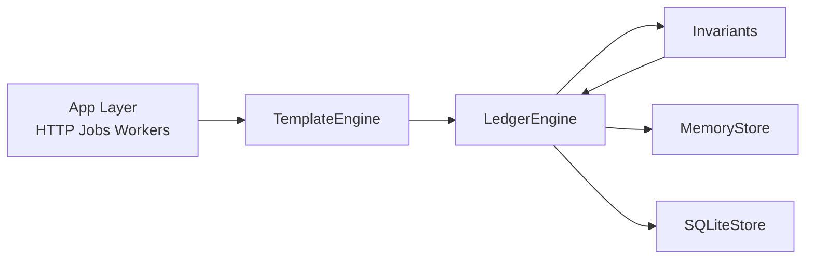

# NeoCore
[](https://github.com/markinkus/neocore-ledger/actions/workflows/ci.yml)
[](https://www.python.org/downloads/)
[](LICENSE)
[](pyproject.toml)
[](pyproject.toml)

NeoCore is a strict ledger kernel for financial systems.

It gives you the accounting core you cannot afford to get wrong: double-entry, append-only persistence, Decimal-only money, and idempotent posting.

> Build APIs, auth, and workflows around NeoCore. Keep the accounting invariants in one place.

## System Map


## Core Invariants
| Invariant | Why it matters | Enforced in | Tested in |
|---|---|---|---|
| `no float` | Prevents precision drift | `Money.__post_init__` | `tests/test_money.py` |
| `always balanced` | Guarantees accounting correctness per currency | `Transaction` validation | `tests/test_ledger/test_engine.py` |
| `append-only` | Preserves audit history | Store behavior | `tests/test_ledger/test_store.py` |
| `idempotent post` | Safe retries for webhook/polling duplicates | `LedgerEngine.post` | `tests/test_ledger/test_engine.py` |
| `currency-consistent` | Prevents cross-currency account corruption | Invariants + engine checks | `tests/test_invariants.py` |

Development setup:
```bash
python3.11 -m pip install ".[dev]"
python3.11 -m pytest -q
python3.11 -m ruff check .
python3.11 -m mypy --strict .
```

## 20-Second Demo
Run the end-to-end payment rail scenario:
```bash
python3.11 -m neocore.scenarios.payment_rail
```

Alternative:
```bash
python3.11 examples/payment_rail.py
```

Example output:
```text
NeoCore Payment Rail Demo
happy_path(authorize=100, capture=100, settle fee=1)
customer: Money(0.00 EUR)
clearing: Money(0.00 EUR)
merchant: Money(0.00 EUR)
    bank: Money(-1.00 EUR)
    fees: Money(1.00 EUR)
```

## Minimal Example
```python
from decimal import Decimal
from neocore.invariants import OverdraftPolicy
from neocore.ledger.engine import LedgerEngine, PostingInstruction
from neocore.ledger.models import AccountType, EntryType
from neocore.ledger.store import MemoryStore
from neocore.money import Money

ledger = LedgerEngine(MemoryStore())
ledger.create_account(id="cash", name="Cash", account_type=AccountType.ASSET, currency="EUR", metadata={})
ledger.create_account(id="bank", name="Bank", account_type=AccountType.LIABILITY, currency="EUR", metadata={})
ledger.post(idempotency_key="ex-1", description="seed", entries=[
    PostingInstruction("cash", EntryType.DEBIT, Money(Decimal("10.00"), "EUR")),
    PostingInstruction("bank", EntryType.CREDIT, Money(Decimal("10.00"), "EUR")),
], metadata={}, overdraft_policy=OverdraftPolicy.allow_overdraft())
print(ledger.get_balance("cash"))
```

## Why NeoCore
| Option | Positioning |
|---|---|
| `beancount`, `django-ledger` | Strong accounting tools; NeoCore focuses on transaction kernel + posting templates + payment rail scenario. |
| `Apache Fineract` and similar | Full banking platforms; NeoCore is intentionally small, embeddable, and integration-friendly. |
| NeoCore | Enforceable invariants, typed APIs, and cross-store testability (memory and SQLite). |

## Roadmap
- [x] v0.1.0 - Kernel + templates + payment rail scenario
- [~] v0.2.0 - SQLiteStore + durable idempotency persistence (partially complete)
- [ ] v0.3.0 - Postgres store
- [ ] v0.4.0 - ISO20022 adapters

## Docs
- [Double-entry in 3 minutes](docs/double-entry-in-3-minutes.md)
- [Idempotency and retry](docs/idempotency-and-retry.md)
- [Posting templates and payment rail](docs/posting-templates-and-payment-rail.md)

## Decision Log
- [001 - Why Decimal](docs/decisions/001-why-decimal.md)
- [002 - Why Append-Only](docs/decisions/002-why-append-only.md)
- [003 - Why Templates](docs/decisions/003-why-templates.md)
- [004 - Why Payment Rail](docs/decisions/004-why-payment-rail.md)

## Contributing
See [CONTRIBUTING.md](CONTRIBUTING.md).
